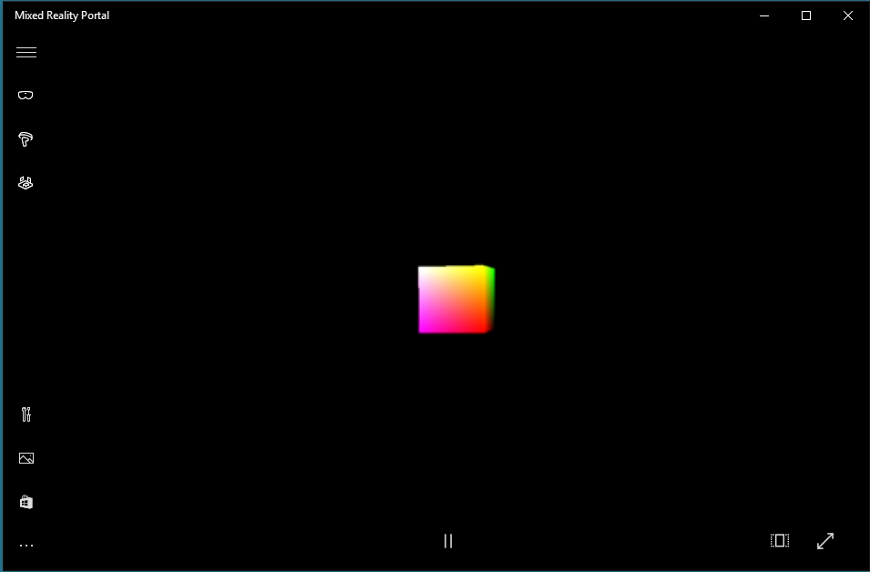
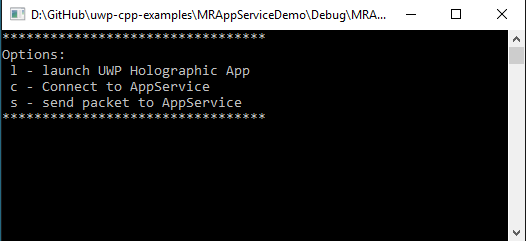
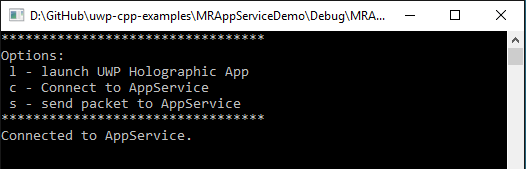
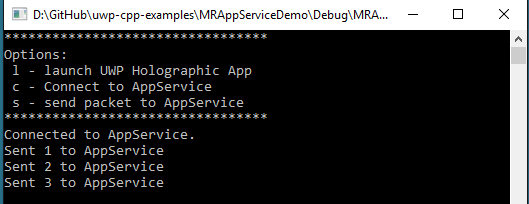
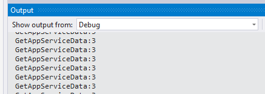
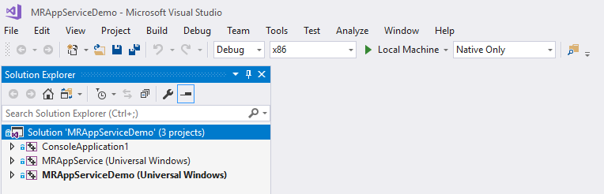
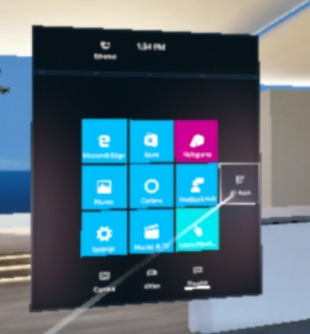
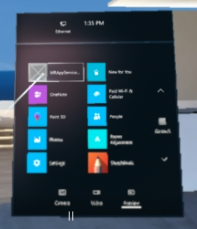

# Mixed Reality AppService Demo
This sample demonstrates how to create a Desktop Bridge version of a UWP Mixed Reality app that can launch a Win32 exe and communicate
between the UWP and Win32 apps via an AppSerice. The UWP Mixed Reality app will continue to run in the HMD while the Win32 exe will run on the
user's desktop. Both apps connect to an AppService so data may be exchanged between the 2 processes.

This configuration enables a Desktop Bridge version of a UWP Mixed Reality app to appear in the list of installed apps in the Mixed Reality Portal.

Note: This example will not work for the Hololens as it is not able to launch a Win32 application.

## Requirements

[Install the Windows Mixed Reality Development Tools](https://developer.microsoft.com/en-us/windows/mixed-reality/install_the_tools)

## Running the Sample

* Open MRAppServiceDemo.sln with Visual Studio 2017

* Launch the Windows Mixed Reality Portal and setup your HMD device or Mixed Reality simulator)

* Select the Debug/x86 or Debug/x64 configuration. 

* Select Local Machine as the target device.

* Set the MRAppServiceDemo project as the StartUp project

* Press F5 to build and run the solution. The MRAppServiceDemo app should run in the Mixed Reality Portal.



* Tap (or right click if using the Simulator) anywhere in the app's window. The Win32 console app will be launched on the user's desktop.



* In the Win32 console app press the c key on the keyboard to connect the app to the App Service.



* In the Win32 console app press the s key to send data to the UWP Mixed Reality app via the App Service.



* The UWP app will display the received data in the Debug output window of VS2017.



## Discussion

The MRAppServiceDemo solution consists of the following projects:

* **MRAppServiceDemo**: The UWP Windows Mixed Reality project (based on the Windows univeral C++ Holographic template)

* **MRAppService**: A UWP [AppService](https://docs.microsoft.com/en-us/windows/uwp/launch-resume/how-to-create-and-consume-an-app-service) 
that connects the UWP and Win32 apps and enables them to exchange data

* **ConsoleApplication1**: A simple Win32 C++ console app that is enabled to consume the Windows RunTime Extension.



## MRAppServiceDemo

The UWP Windows Mixed Reality project (based on the Windows univeral C++ Holographic template) is the startup app for this solution. When the app is launched by the user it will 
run in the Mixed Reality Portal and will be displayed in the HMD device. When deployed to the user's computer, the MRAppServiceDemo app will also appear in Apps listing in the Mixed Reality Portal.
Selecting the MRAppServiceDemo app from the list will launch the app in the Portal.





In order for this to work, the following changes were made to the Package.appxmanifest in the MRAppServiceDemo project.

* Right-click on the **Package.appxmanifest** file in the solution and select **Open With...**

* Select the **XML (Text) Editor** option.

* The following namespaces were added to the **Package** section

```xml
xmlns:uap2="http://schemas.microsoft.com/appx/manifest/uap/windows10/2"
xmlns:uap3="http://schemas.microsoft.com/appx/manifest/uap/windows10/3"
xmlns:uap4="http://schemas.microsoft.com/appx/manifest/uap/windows10/4"
xmlns:rescap="http://schemas.microsoft.com/appx/manifest/foundation/windows10/restrictedcapabilities"
xmlns:desktop="http://schemas.microsoft.com/appx/manifest/desktop/windows10"
  
IgnorableNamespaces="uap uap2 uap3 uap4 mp rescap desktop">
```

* The **runFullTrust** capability was added to the **Capabilities** section
```xml
<Capabilities>
<Capability Name="internetClient" />
<rescap:Capability Name="runFullTrust" />
</Capabilities>
```

* The AppService was declared in the **Extensions** section of the **Application** section for the MRAppServiceDemo app.

 ```xml
 <Extensions>
	<uap:Extension Category="windows.appService" EntryPoint="MRAppService.AppService">
	  <uap:AppService Name="com.mrappservicedemo.appservice" uap4:SupportsMultipleInstances="false"/>
	</uap:Extension>
  </Extensions>
```

* The protocol to enable launching of the MRAppServiceDemo UWP Holographic App from the Win32 app was also added to the **Extensions** section of the **Application** section for the MRAppServiceDemo app.

```xml
<Extensions>
<uap:Extension Category="windows.appService" EntryPoint="MRAppService.AppService">
  <uap:AppService Name="com.mrappservicedemo.appservice" uap4:SupportsMultipleInstances="false"/>
</uap:Extension>
<uap:Extension Category="windows.protocol" Executable="$targetnametoken$.exe" EntryPoint="MRAppServiceDemo.AppView">
  <uap:Protocol Name="mrappservicedemo" />
</uap:Extension>
</Extensions>
```

* The Win32 console app was declared by adding a new **Application** tag to the **Applications** section. It must appear **after** the Application section for the MRAppServiceDemo app. 
```xml
<Application Id="ConsoleApp"
  Executable="ConsoleApplication1.exe"
  EntryPoint="Windows.FullTrustApplication">
  <uap:VisualElements
	DisplayName="ConsoleApp"
	Square150x150Logo="Assets\Square150x150Logo.png"
	Square44x44Logo="Assets\Square44x44Logo.png"
	Description="MRAppServiceDemo"
	BackgroundColor="#464646">
	<uap:DefaultTile Wide310x150Logo="Assets\Wide310x150Logo.png" />
	<uap:SplashScreen Image="Assets\SplashScreen.png" />
  </uap:VisualElements>
</Application>
```

The complete Package.appxmanifest is available [here](https://github.com/stammen/uwp-cpp-examples/blob/master/MRAppServiceDemo/MRAppServiceDemo/Package.appxmanifest)