# Mixed Reality/Centennial App Demo
This sample demonstrates how to create a Centennial(Desktop Bridge) version of a UWP Mixed Reality app that use Win32 apis that are not allowed in a UWP app but are allowed in a Desktop Bridge app.
This example demonstrates how to capture the primary desktop from a Win32 DLL and package it with a UWP Mixed Reality app via the Desktop Bridge.

This configuration enables a Desktop Bridge version of a UWP Mixed Reality app to appear in the list of installed apps in the Mixed Reality Portal.

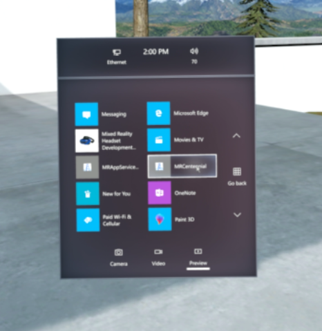

Note: This example will not work for the Hololens as it is not able to launch a Win32 application.

## Requirements

[Install the Windows Mixed Reality Development Tools](https://developer.microsoft.com/en-us/windows/mixed-reality/install_the_tools)

## Running the Sample

* Open MRCentennial.sln with Visual Studio 2017

* Launch the Windows Mixed Reality Portal and setup your HMD device or Mixed Reality simulator)

* Select the Debug/x86 or Debug/x64 configuration. 

* Select Local Machine as the target device.

* Set the MRCentennial project as the StartUp project

* Press F5 to build and run the solution. The MRCentennial app should run in the Mixed Reality Portal.

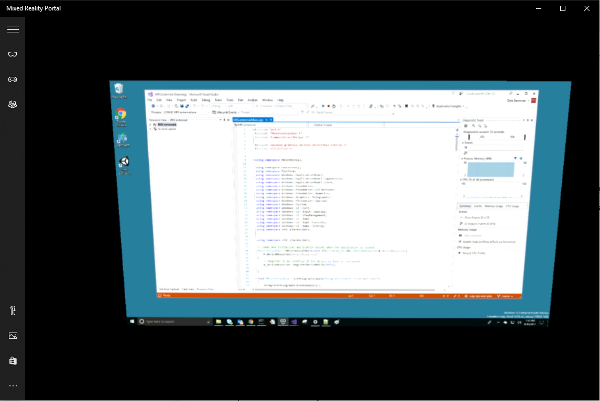

* After the UWP MR app has launched in the MR Portal, it will capture and display the primary desktop in a quad texture in the UWP immersive environment.


## Discussion

The MRCentennial solution consists of the following projects:

* **MRCentennial**: The UWP Windows Mixed Reality project (based on the Windows univeral C++ Holographic template)

* **ScreenCapture**: A Desktop Win32 DLL (not a Univeral Windows DLL) that uses GetDIBits and other GDI functions to screen capture the primary monitor. These GDI functions are not allowed in a regular Mixed Reality UWP app.


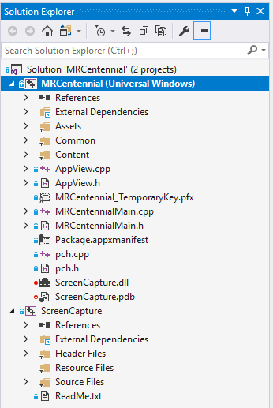


In order for this to work, the following changes were made to the Package.appxmanifest in the MRCentennial project.

* Right-click on the **Package.appxmanifest** file in the solution and select **Open With...**

* Select the **XML (Text) Editor** option.

* The following namespaces were added to the **Package** section

```xml
xmlns:uap2="http://schemas.microsoft.com/appx/manifest/uap/windows10/2"
xmlns:uap3="http://schemas.microsoft.com/appx/manifest/uap/windows10/3"
xmlns:uap4="http://schemas.microsoft.com/appx/manifest/uap/windows10/4"
xmlns:rescap="http://schemas.microsoft.com/appx/manifest/foundation/windows10/restrictedcapabilities"
xmlns:desktop="http://schemas.microsoft.com/appx/manifest/desktop/windows10"
  
IgnorableNamespaces="uap uap2 uap3 uap4 mp rescap desktop">
```

* The **runFullTrust** capability was added to the **Capabilities** section
```xml
<Capabilities>
	<Capability Name="internetClient" />
	<rescap:Capability Name="runFullTrust" />
</Capabilities>
```

The complete Package.appxmanifest is available [here](https://github.com/stammen/uwp-cpp-examples/blob/master/MRCentennial/MRCentennial/Package.appxmanifest).

## Adding the Win32 DLLs to the AppX Package

The ScreenCapture Win32 DLL needs to be added to the AppX package of the MRCentennial UWP app. Note: simplying xcopying the DLL to the output dir will not work for a UWP App. 

* Right-click on the MRCentennial Project and select **Unload Project**.

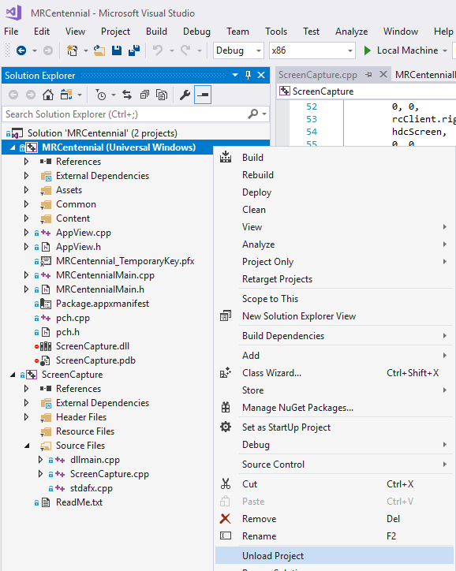

* Right-click on the MRCentennial Project and select **Edit Project**.

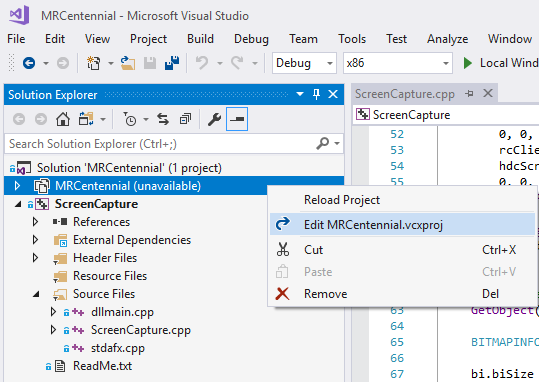

* Add the following XML near the end of the file:

```xml
  <PropertyGroup Label="DesktopBridge">
    <BinPath Condition=" '$(BinPath)' == '' ">$(SolutionDir)\$(Platform)\$(Configuration)\</BinPath>
  </PropertyGroup>
  <ItemGroup Label="DesktopBridge">
    <None Include="$(BinPath)ScreenCapture.dll">
      <DeploymentContent>true</DeploymentContent>
    </None>
    <None Include="$(BinPath)ScreenCapture.pdb">
      <DeploymentContent>true</DeploymentContent>
    </None>
  </ItemGroup>
 ```
 
* Right-click on the MRCentennial Project and select **Reload Project**.

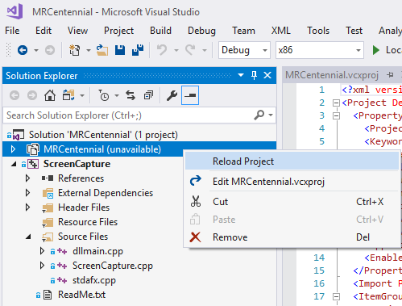

* Build and run the project. The DLLs will be correctly copied into the AppX.

## Windows App Certification Kit (WACK)

It is important to run the Windows App Certification Kit (WACK) tool on your AppX in order to determine if there are any issues with your app before your submit it to the Store. 

Using the following procedure to test your app with WACK.
 
* Right-click on the MRCentennial Project and select **Store | Create App Packages...**.

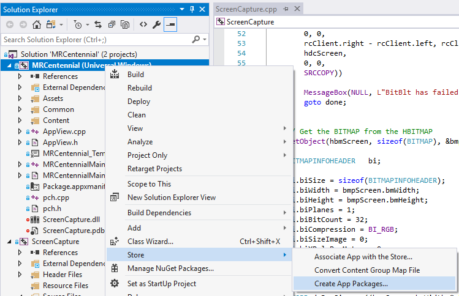

* Select the **No** Option and click **Next**.

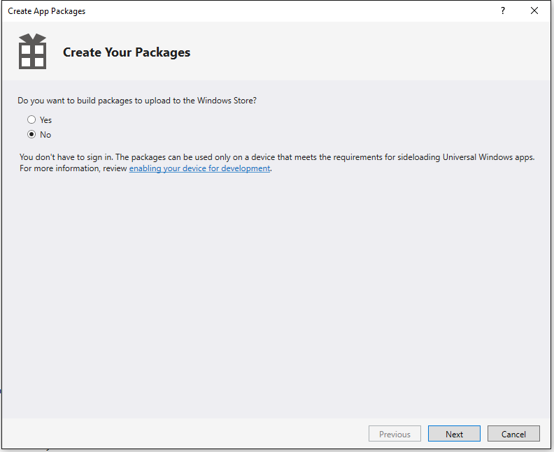

* Select the **x86** and **x64** options. Make sure you select **Release** configurations. Click **Create**.

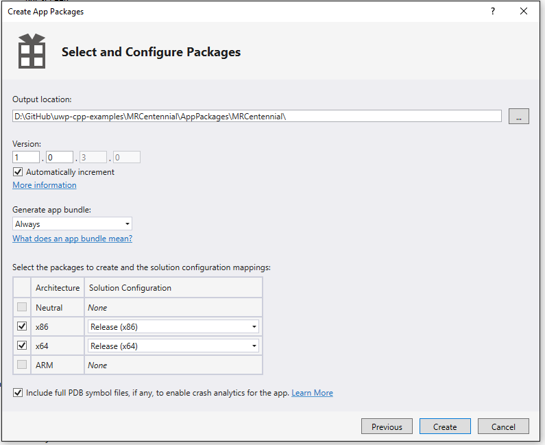

* After the AppX packages are created, click on **Launch Windows App Certification Kit**.

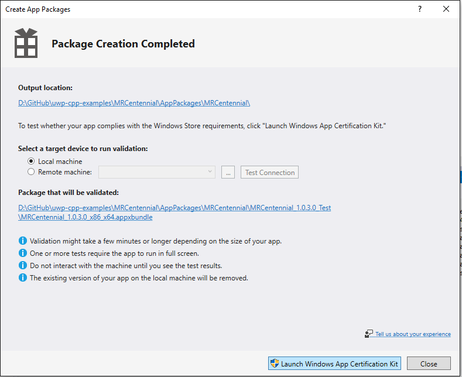

* Make sure all tests are selected (Select All) and then click **Next**.

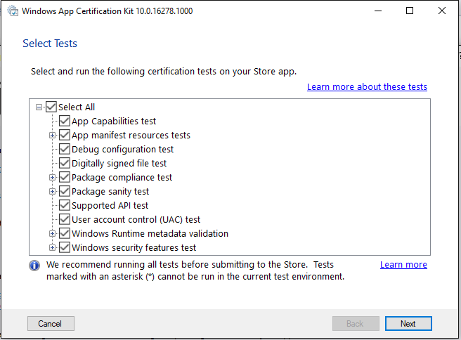

You app should pass all of the tests. If not click on the "Click here to review the results" link to explore what went wrong.

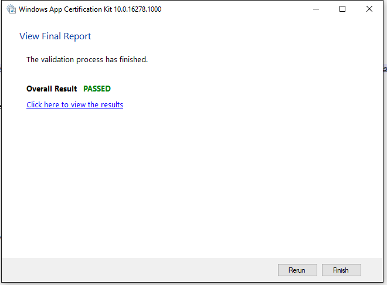


